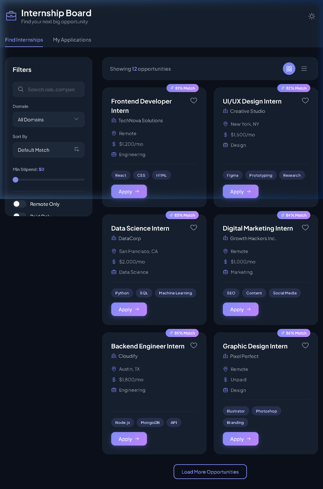
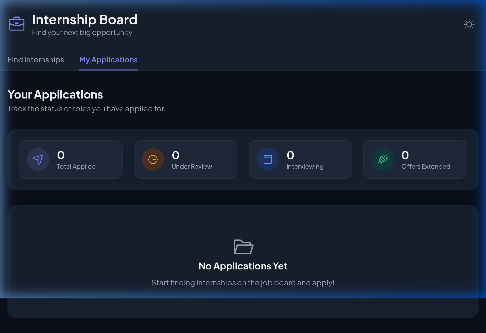

# Responsive Internship Board

An accessible, responsive internship listing interface built with plain HTML, CSS, and Vanilla JS (no framework). 

## Features
- **Premium UI (Glassmorphism):** Frosted glass effects, sleek typography, and a "Midnight" dark mode for a modern feel.
- **Micro-Animations:** Staggered loading, 3D hover effects on cards, and smooth modal transitions.
- **Advanced Filtering:** Dynamic filtering via a sidebar, including a new Stipend Range slider.
- **Smart Features:** A mock AI-driven "Smart Match" score on job cards and an Application Analytics Dashboard.
- **Semantic HTML & Accessibility:** Meaningful landmarks (`<header>`, `<main>`), proper labels, and `aria-live` regions.
- **Responsive Layout:** Fluid CSS grid/flexbox layout that adapts to mobile, tablet, and desktop views seamlessly.

## Screenshots

### Job Board (Advanced Filters & Smart Match)

### My Applications (Analytics Dashboard)

## Responsive Testing Results

| Device / Width | Layout Behavior | Navigation / Usability |
| :--- | :--- | :--- |
| **Mobile (360px)** | Single column grid. Controls are stacked vertically. | Excellent touch targets. Vertical scrolling is smooth. |
| **Tablet (768px)** | Two-column grid for cards. Controls form a row (Search takes remaining space, Select is fixed width). | Good balance of content, easy to read on medium screens. |
| **Desktop (1024px+)**| Three-column grid for cards. Header aligns left. | Maximizes screen real estate while keeping line lengths comfortable. |

## How to Run Locally
1. Clone this repository.
2. Open `index.html` in your web browser (or use a local server like Live Server for VS Code).

## How to Deploy to GitHub Pages
1. Initialize a git repository: `git init`
2. Add files and commit: `git add .` and `git commit -m "Initial commit"`
3. Create a new repository on GitHub and link it: `git remote add origin <your-repo-url>`
4. Push the code: `git push -u origin main`
5. Go to your GitHub repository settings -> Pages. Select the `main` branch as the source and save. Your site will be published at `https://<your-username>.github.io/<repo-name>`.
